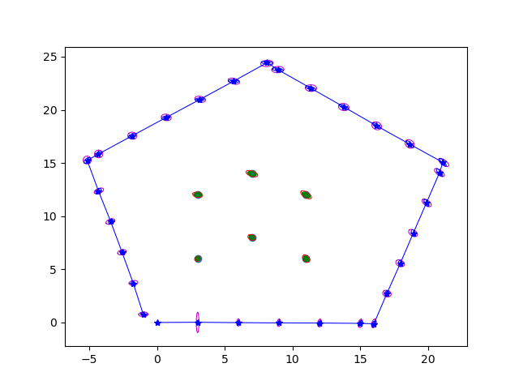
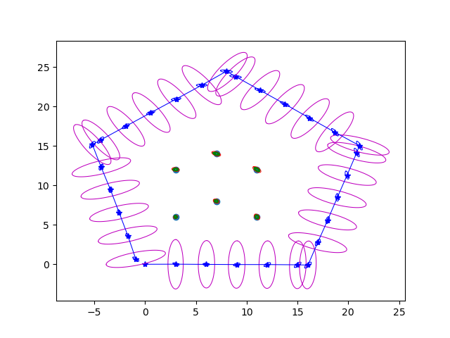
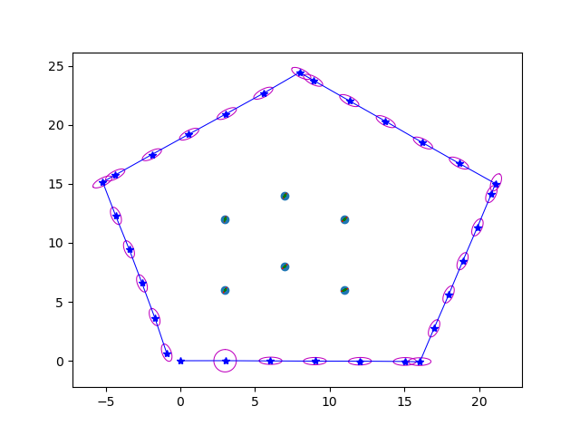
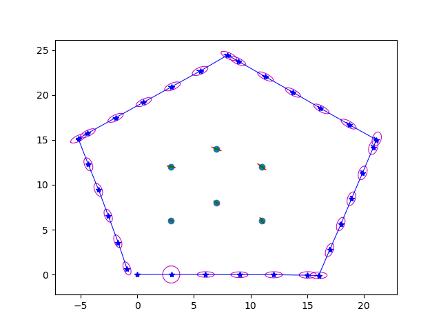

### Q2

#### Part 1
We have 6 landmarks observed over the entire sequence as per the log file.

#### Part 2

#### Part 3

As seen in the visualization, as the robot moves through the environment, the uncertainty in robot pose, as well as the uncertainty in the location of the landmarks reduces over time. 

#### Part 4

As seen in the visualization, the ground truth position is marked in red. It is noticed that the ground truth poses are present inside the smallest ellipse of each landmark. This implies that the true position lies within the 1$\sigma$ distances in each axis of the belief of the landmark.

The distances are - 

| Euclidean distance | Mahalanobis distance |
| --- | --- |
| 0.0021917046604804902 | 0.057501186275044545 | 
| 0.004172732507937598 | 0.07660115444656469 | 
| 0.002523110629757686 | 0.05785024216850864 | 
| 0.0027936346213239768 | 0.07264924497304755 | 
| 0.0019271182372577842 | 0.032849790695723496 | 
| 0.003997375517186763 | 0.10767716415915088 | 

We can see that the Euclidean distances are extremely small, and are very close to the actual ground truth.

Thr Mahalanobis distance is also extremely small, meaning that the belief of the landmark is very close to the actual landmark location.

### Q3

#### Part 1

The zero-terms in the initial covariance matrix becomes non-zero later on because:
- As the robot moves through the environment, we accumulate information about the landmarks viewed from different robot poses. Thus, updating information about the landmarks viewed from different poses can lead to uncertainties being introduced in new dimensions in the local coordinate frame of the new robot pose. Since we frame the observation of the robot w.r.t robot pose, new robot poses add uncertainty in new directions, leading to non zero values for values initialized with 0 covariances. 

The assumption that we made was that the landmarks are independent of each other. This is not an accurate assumption since a var    ied belief in one landmark means that the belief of the other landmark should also change. This is because there is a fixed spatial separation of the landmarks in the real world.

#### Part 2

|$\sigma_x = 2.5$ | $\sigma_x = 0.025$ | $\sigma_x = 0.25$ |
| --- | --- | -- | 
|  |  | | 

Increasing the variance of the process model in the x-direction makes the belief of the robot more uncertain in the x-direction. This is visible clearly in the picture above. Decreasing the variance makes us more certain about the position in the x-direction, which is also visible in the diagram.

|$\sigma_y = 1.0$ | $\sigma_y = 0.01$ | $\sigma_y = 0.1$ |
| --- | --- | -- | 
|  |  | | 

Increasing the variance of the process model in the y-direction makes the belief of the robot more uncertain in the y-direction. This is visible clearly in the picture above. Decreasing the variance makes us more certain about the position in the y-direction, which is also visible in the diagram. We notice the opposite effect when we scale the variance down.

|$\sigma_{\alpha} = 1.0$ | $\sigma_{\alpha} = 0.01$ | $\sigma_{\alpha} = 0.1$ |
| --- | --- | -- | 
|  |  | | 

Increasing the variance $\alpha$ which corresponds to rotations makes us uncertain at sharp turns where the robot makes a turn. We can see the same when the robot reaches the corner of the pentagon, where the uncertainty goes up significantly. We notice the opposite effect when we scale the variance down.

|$\sigma_{\beta} = 0.1$ | $\sigma_{\beta} = 0.001$ | $\sigma_{\beta} = 0.01$ |
| --- | --- | -- | 
|  |  | | 

By increasing the variance in $\beta$, we notice that we are much more uncertain about the exact heading of the location of the landmark with respect to the robot. This is most readily observable at the initial pose, where we notice that the dominant direction of the Gaussian distribution is tangential to a circle centered around the robot pose, with radius = distance between landmark and robot. We notice the opposite effect when we scale the variance down.

|$\sigma_{r} = 0.8$ | $\sigma_{r} = 0.008$ | $\sigma_{r} = 0.08$ |
| --- | --- | -- | 
|  |  | | 

By increasing the variance in $r$, we notice that we are much more uncertain about the exact distance of the landmark with respect to the robot. We can see that the Gaussian distributions have a dominant axis along the direction of the line connecting the robot and the landmark, meaning that the uncertainty in the range measurement is much more than the uncertainty in the heading measurement. We notice the opposite effect when we scale the variance down.

#### Part 3

- We can exploit the sparsity in the observations. If we do not observe every landmark at each timestep, we can update only parts of the state vector that has changed, and ignore states of landmarks which haven't changed. 
- We can sample a fixed number of landmarks are each iteration that are closest to the robot. While this may sacrifice accuracy, we can ensure constant runtime.
- Over time, landmarks that are seen a long time ago may have lost relevance as they are no longer seen as frequently. We can create a mechanism where we discard/decay landmarks after a certain amount of time.
- We can vectorize the implementation to improve speed.