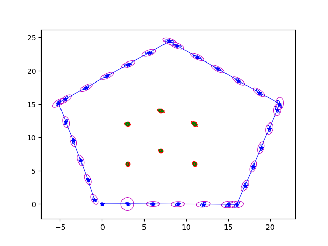
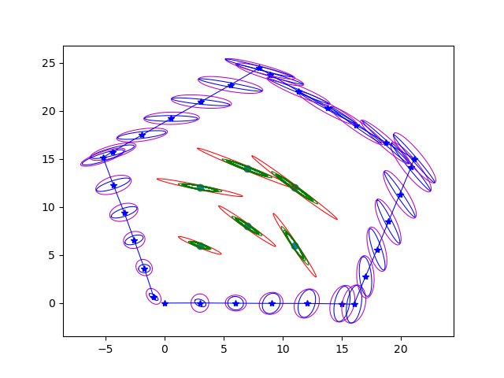
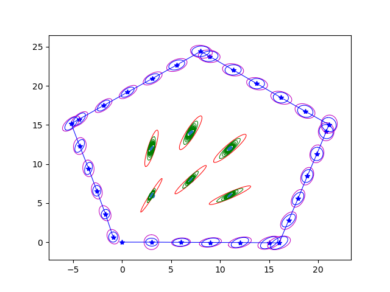

### Q2

### Q3

#### Part 2

|$\sigma_x = 2.5$ | $\sigma_x = 0.025$ | $\sigma_x = 0.25$ |
| --- | --- | -- | 
|  |  | | 

|$\sigma_y = 1.0$ | $\sigma_y = 0.01$ | $\sigma_y = 0.1$ |
| --- | --- | -- | 
|  |  | | 

|$\sigma_{\alpha} = 1.0$ | $\sigma_{\alpha} = 0.01$ | $\sigma_{\alpha} = 0.1$ |
| --- | --- | -- | 
|  |  | | 

|$\sigma_{b} = 0.1$ | $\sigma_{b} = 0.001$ | $\sigma_{b} = 0.01$ |
| --- | --- | -- | 
|  |  | | 

|$\sigma_{\alpha} = 1.0$ | $\sigma_{\alpha} = 0.01$ | $\sigma_{\alpha} = 0.1$ |
| --- | --- | -- | 
|  |  | | 

|$\sigma_{r} = 0.8$ | $\sigma_{r} = 0.008$ | $\sigma_{r} = 0.08$ |
| --- | --- | -- | 
|  |  | | 